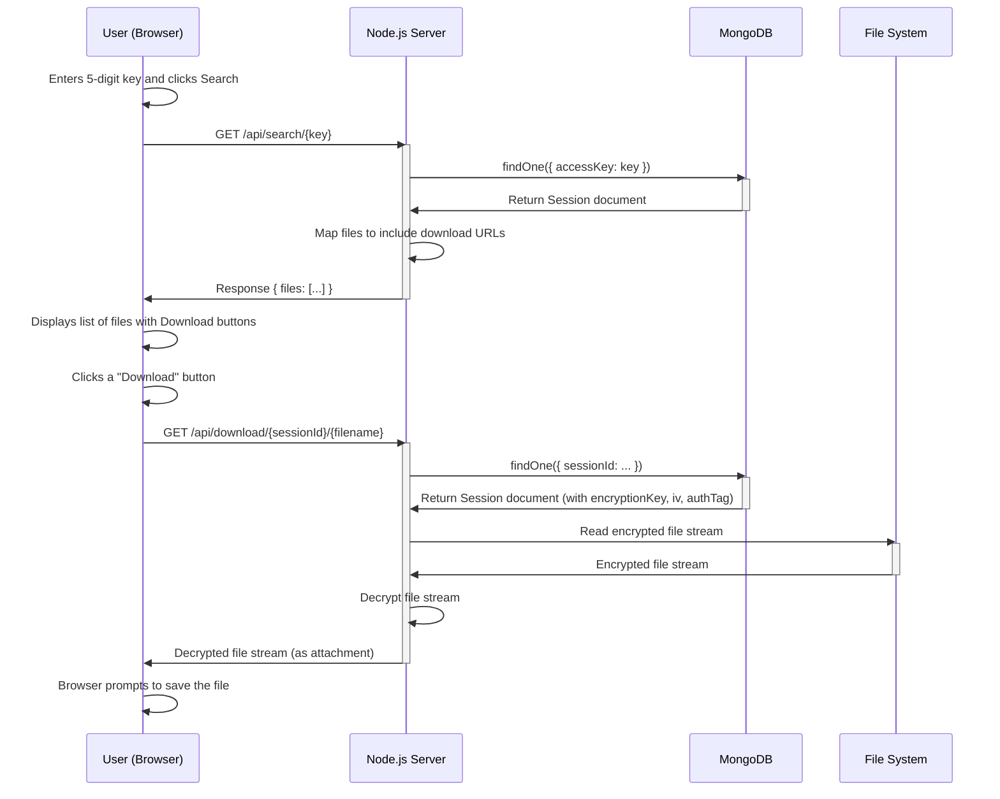
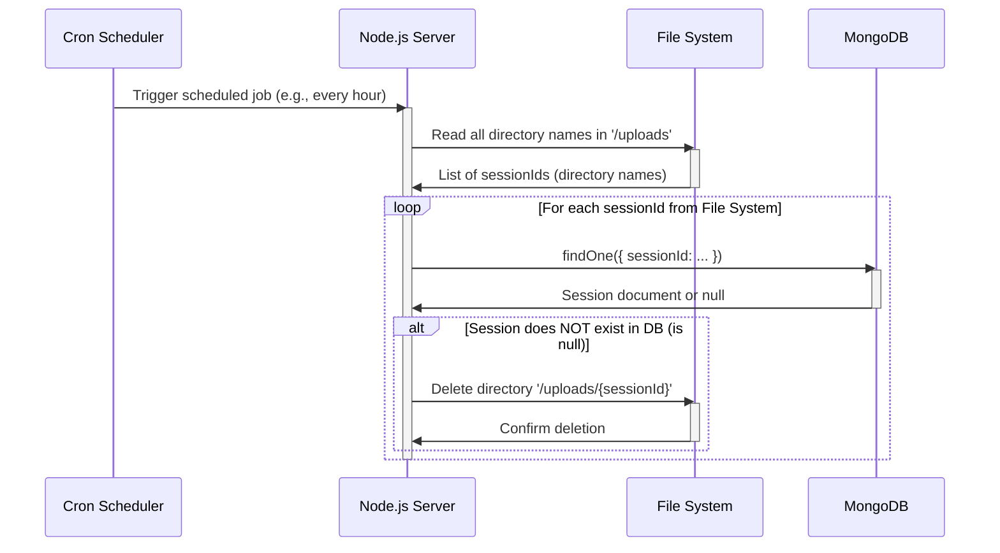

# Sequence Diagrams for All Other Tasks

This document contains sequence diagrams for additional functionalities in the Fileora-App system that were not covered in the initial upload flows.

## 1. File Search and Download Flow

This diagram illustrates the process where a user, who already has an access key, searches for and downloads the associated files.

## 2. Orphaned File Cleanup Flow (Cron Job)

This diagram shows the automated background process that runs periodically to clean up stored files that no longer have a valid session in the database.

