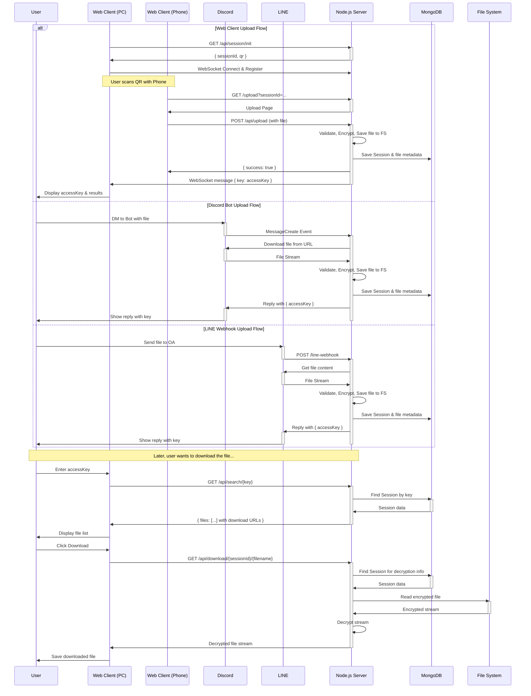

# Full System Sequence Diagram

This diagram provides a comprehensive overview of the entire Fileora-App system, combining the three main upload methods (Web, Discord, LINE) and the subsequent common task of searching for and downloading the file.

