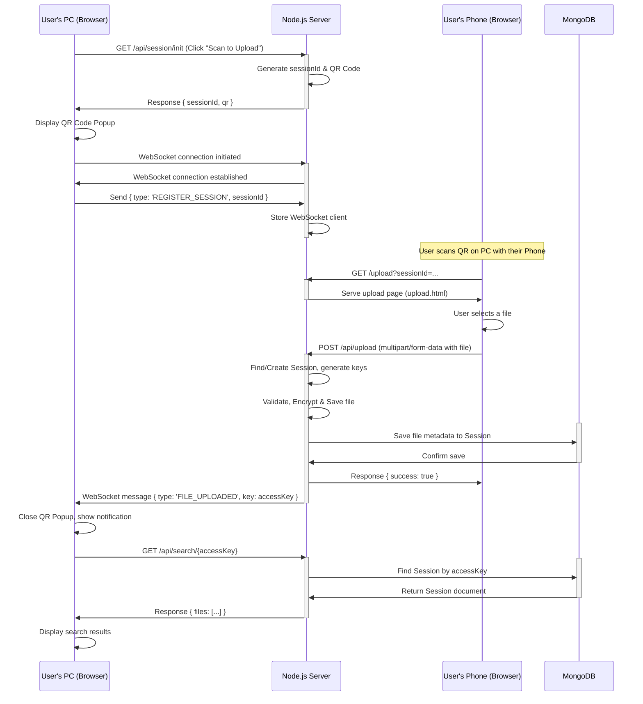
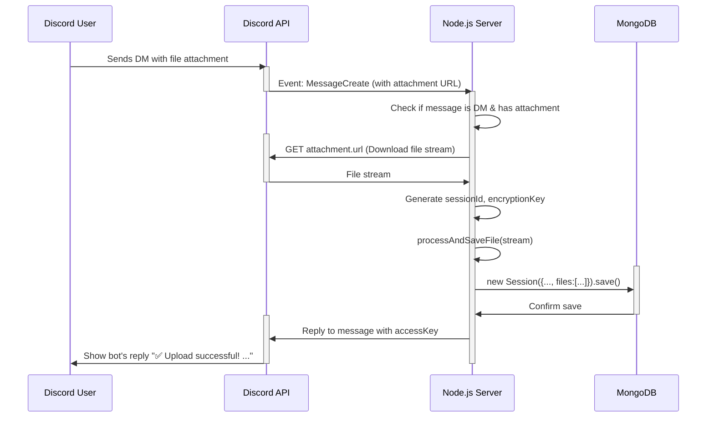
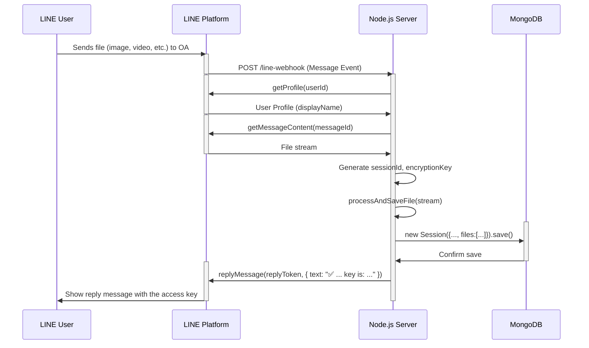

# Sequence Diagrams for Fileora-App

This document contains sequence diagrams illustrating the different file upload processes in the Fileora-App project.

## 1. Web Client Flow

This diagram shows the process when a user uploads a file through the web interface. The user starts on a primary device (e.g., a PC) and uses a secondary device (e.g., a phone) to scan a QR code and upload the file.

## 2. Discord Bot Flow

This diagram illustrates how a user uploads a file by sending it as a direct message to the Discord Bot.

## 3. Line Webhook Flow

This diagram shows the process for a file upload via a LINE Official Account.

