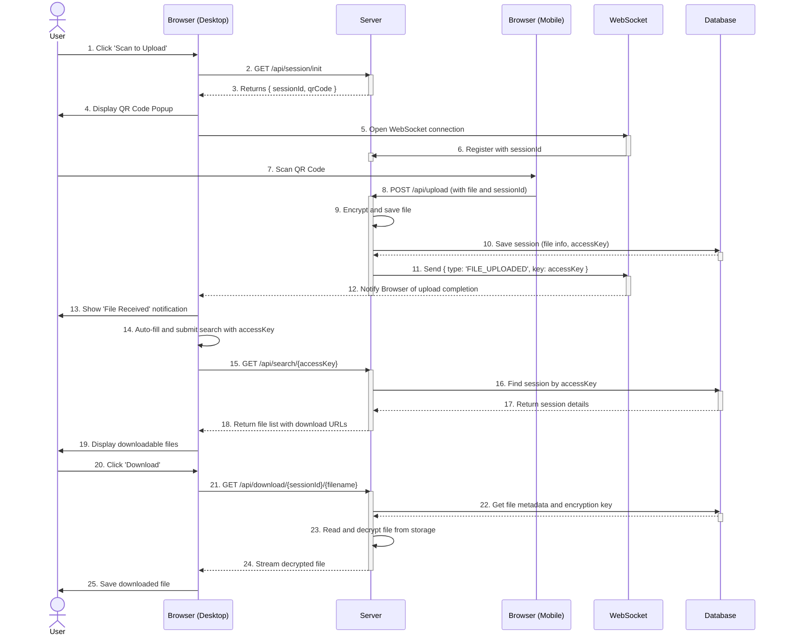

```mermaid
sequenceDiagram
    actor User
    participant Browser as Browser (Desktop)
    participant Server
    participant MobileDevice as Browser (Mobile)
    participant WebSocket
    participant Database

    User->>Browser: 1. Click 'Scan to Upload'
    Browser->>Server: 2. GET /api/session/init
    activate Server
    Server-->>Browser: 3. Returns { sessionId, qrCode }
    deactivate Server
    Browser->>User: 4. Display QR Code Popup
    Browser->>WebSocket: 5. Open WebSocket connection
    activate WebSocket
    WebSocket->>Server: 6. Register with sessionId
    activate Server
    deactivate Server
    deactivate WebSocket

    User->>MobileDevice: 7. Scan QR Code
    MobileDevice->>Server: 8. POST /api/upload (with file and sessionId)
    activate Server
    Server->>Server: 9. Encrypt and save file
    Server->>Database: 10. Save session (file info, accessKey)
    activate Database
    Database-->>Server: 
    deactivate Database
    Server->>WebSocket: 11. Send { type: 'FILE_UPLOADED', key: accessKey }
    activate WebSocket
    WebSocket-->>Browser: 12. Notify Browser of upload completion
    deactivate WebSocket
    deactivate Server

    Browser->>User: 13. Show 'File Received' notification
    Browser->>Browser: 14. Auto-fill and submit search with accessKey
    Browser->>Server: 15. GET /api/search/{accessKey}
    activate Server
    Server->>Database: 16. Find session by accessKey
    activate Database
    Database-->>Server: 17. Return session details
    deactivate Database
    Server-->>Browser: 18. Return file list with download URLs
    deactivate Server

    Browser->>User: 19. Display downloadable files
    User->>Browser: 20. Click 'Download'
    Browser->>Server: 21. GET /api/download/{sessionId}/{filename}
    activate Server
    Server->>Database: 22. Get file metadata and encryption key
    activate Database
    Database-->>Server: 
    deactivate Database
    Server->>Server: 23. Read and decrypt file from storage
    Server-->>Browser: 24. Stream decrypted file
    deactivate Server
    Browser->>User: 25. Save downloaded file
```
