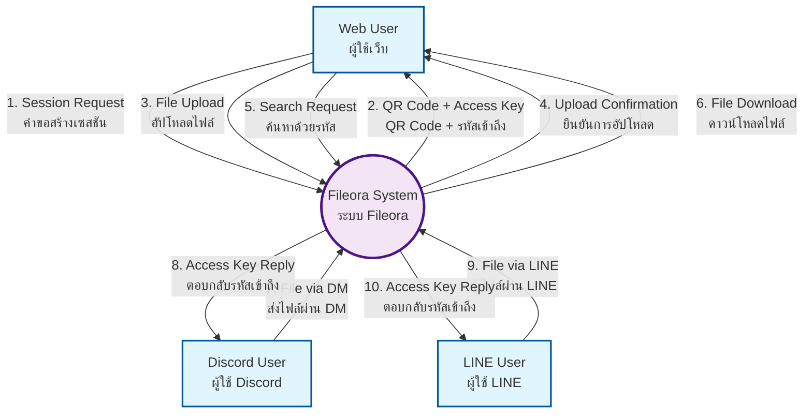
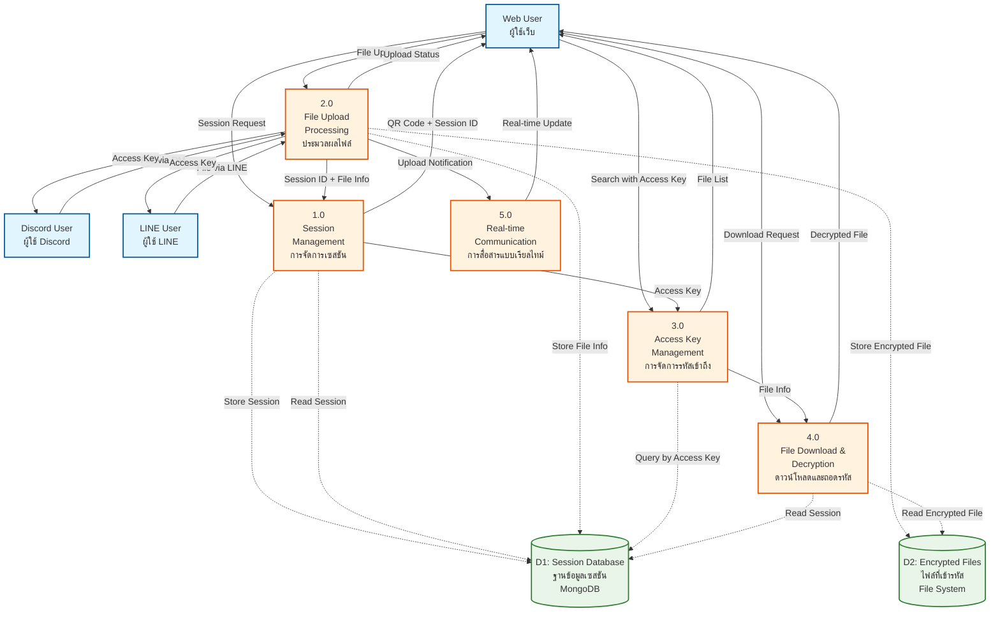
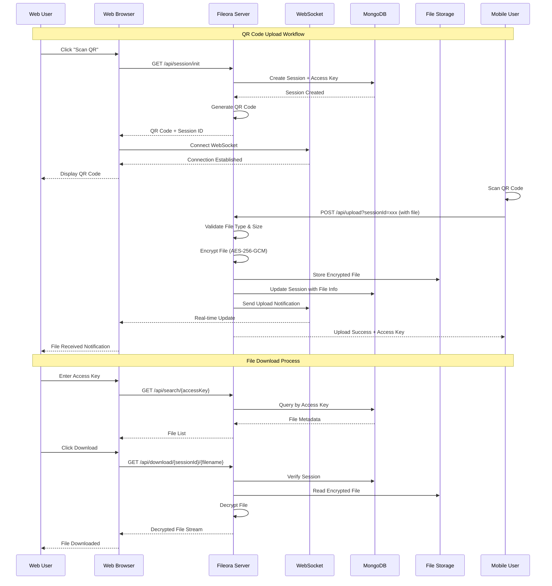
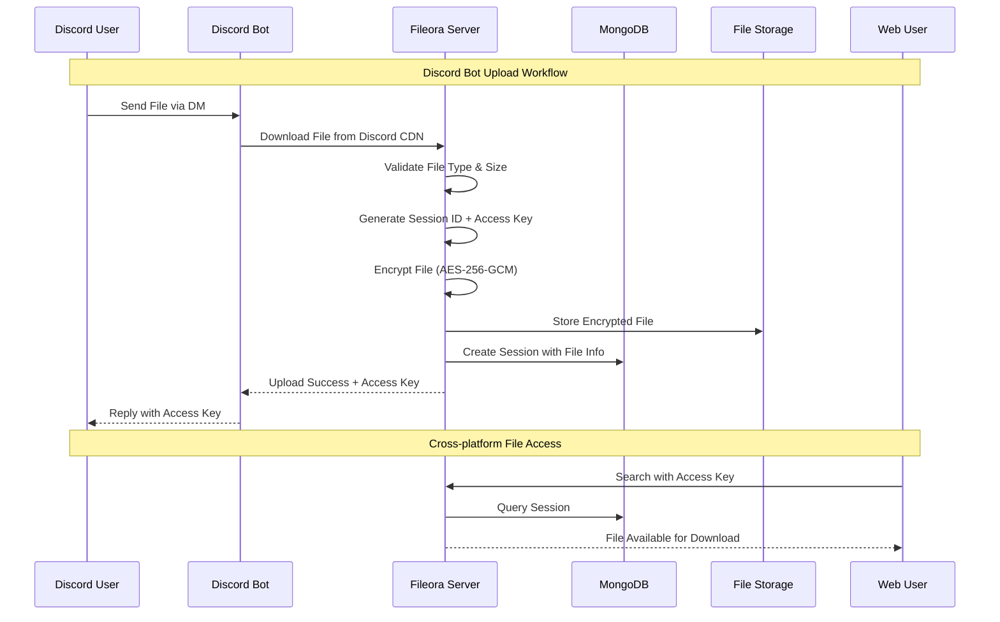
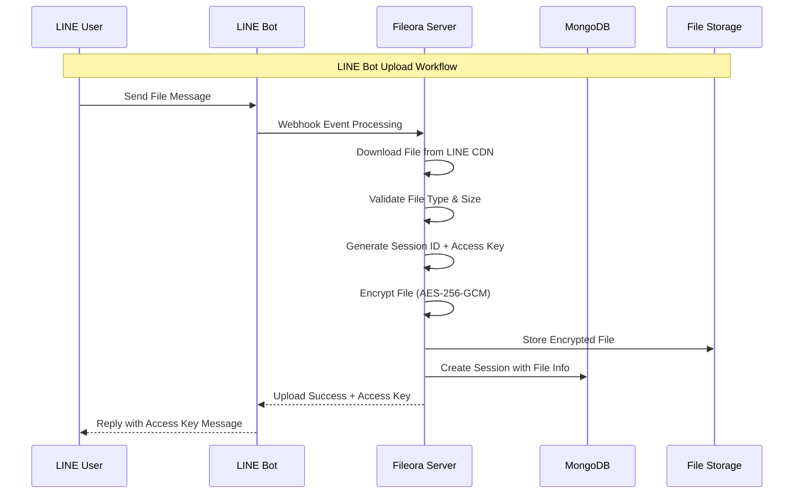
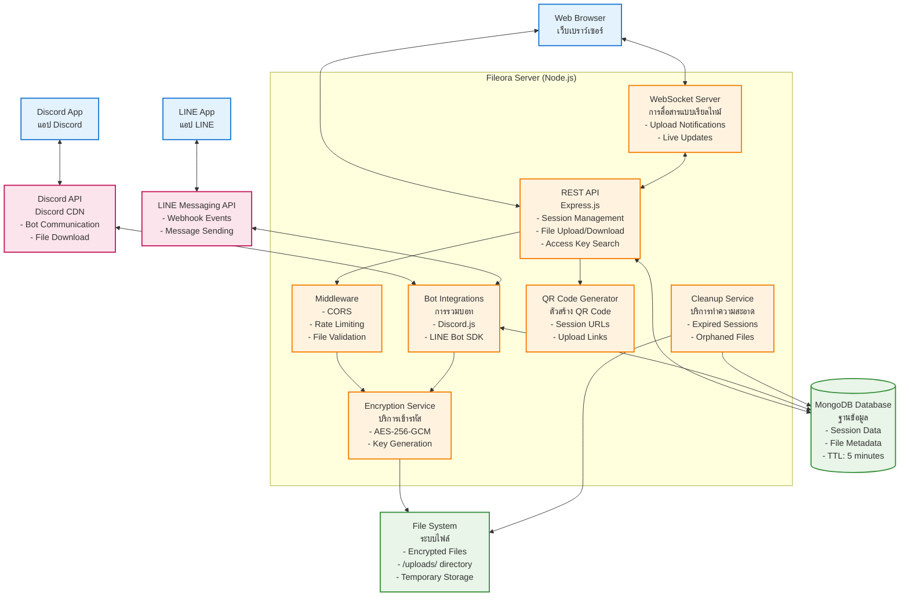

บทที่ 3
วิธีการดำเนินงาน

บทนี้เป็นการอธิบายกระบวนการพัฒนาระบบ Fileora ซึ่งเป็นระบบแชร์ไฟล์แบบเรียลไทม์ที่ใช้เทคโนโลยี QR Code และรองรับหลายแพลตฟอร์ม โดยจะกล่าวถึงการศึกษาเบื้องต้น การกำหนดความต้องการ การออกแบบระบบ การพัฒนา และการทดสอบ เพื่อให้ได้ระบบที่มีประสิทธิภาพและตอบสนองความต้องการของผู้ใช้งาน

3.1 การศึกษาเบื้องต้น

3.1.1 การศึกษาปัญหาของระบบการแชร์ไฟล์แบบดั้งเดิม

ปัจจุบันการส่งถ่ายไฟล์ระหว่างอุปกรณ์ต่างๆ มักประสบปัญหาหลายประการ ดังนี้

1. ปัญหาความซับซ้อนในการใช้งาน: ผู้ใช้ต้องติดตั้งแอปพลิเคชันหลายตัว เช่น Google Drive, Dropbox หรือต้องใช้ Email ในการส่งไฟล์ ซึ่งมีขั้นตอนที่ยุ่งยาก

2. ปัญหาด้านความปลอดภัย: การส่งไฟล์ผ่าน Email หรือบริการ Cloud Storage บางประเภทไม่มีการเข้ารหัสแบบ End-to-End หรือมีการเก็บข้อมูลบนเซิร์ฟเวอร์เป็นระยะเวลานาน

3. ปัญหาข้อจำกัดของขนาดไฟล์: หลายบริการมีการจำกัดขนาดไฟล์หรือจำนวนไฟล์ที่สามารถส่งได้ในแต่ละครั้ง

4. ปัญหาการเข้าถึงข้ามแพลตฟอร์ม: การส่งไฟล์จากอุปกรณ์มือถือไปยังคอมพิวเตอร์ หรือระหว่างระบบปฏิบัติการที่ต่างกันมักมีความยุ่งยาก

3.1.2 การวิเคราะห์ความต้องการของผู้ใช้

จากการศึกษาปัญหาดังกล่าว ผู้พัฒนาได้วิเคราะห์ความต้องการของผู้ใช้งาน ดังนี้

1. ต้องการความง่ายในการใช้งาน: ผู้ใช้ต้องการวิธีการส่งไฟล์ที่รวดเร็วและไม่ซับซ้อน
2. ต้องการความปลอดภัย: ไฟล์ที่ส่งควรมีการเข้ารหัสและมีอายุการใช้งานที่จำกัด
3. ต้องการการเข้าถึงข้ามแพลตฟอร์ม: สามารถส่งไฟล์จากอุปกรณ์ใดก็ได้ไปยังอุปกรณ์ใดก็ได้
4. ต้องการความรวดเร็ว: การถ่ายโอนไฟล์ควรเป็นแบบทันทีและไม่ต้องรอนาน

3.1.3 แนวทางการแก้ปัญหาและวัตถุประสงค์

จากการวิเคราะห์ปัญหาและความต้องการ ผู้พัฒนาได้กำหนดแนวทางการแก้ปัญหาดังนี้

1. พัฒนาระบบการแชร์ไฟล์แบบ QR Code-based เพื่อความง่ายในการใช้งาน
2. ใช้เทคโนโลยี Session-based Architecture ที่มีอายุการใช้งานสั้น (5 นาที) เพื่อความปลอดภัย
3. รองรับการอัปโหลดไฟล์จากหลายแพลตฟอร์ม (Web, Discord, LINE)
4. ใช้ระบบเข้ารหัสไฟล์แบบ AES-256-GCM สำหรับความปลอดภัย
5. ใช้ระบบ Access Key แบบ 5 ตัวอักษรสำหรับการเข้าถึงไฟล์ที่ง่ายต่อการจำ

3.1.4 การศึกษาความเป็นไปได้ทางเทคนิค

การศึกษาความเป็นไปได้ในการพัฒนาระบบ Fileora ได้พิจารณาจากแง่มุมต่างๆ ดังนี้

1. ความเป็นไปได้ทางเทคนิค: ใช้เทคโนโลยี Node.js, Express.js, MongoDB ที่มีความเสถียรและรองรับการพัฒนาอย่างครอบคลุม
2. ความเป็นไปได้ทางด้านการรักษาความปลอดภัย: ใช้ระบบ Crypto ในตัวของ Node.js สำหรับการเข้ารหัส และ TTL (Time To Live) ใน MongoDB สำหรับการหมดอายุอัตโนมัติ
3. ความเป็นไปได้ทางด้าน Scalability: สถาปัตยกรรมของระบบรองรับการขยายตัวและการจัดการ Load ที่เพิ่มขึ้น
4. ความเป็นไปได้ทางด้านการบำรุงรักษา: ใช้ Clean Code Principles และมีระบบทดสอบที่ครอบคลุม

3.2 การกำหนดความต้องการของระบบ

การพัฒนาระบบ Fileora ต้องศึกษาความต้องการของเจ้าของระบบและผู้ใช้ระบบ เพื่อให้ได้ข้อกำหนดความต้องการที่สมบูรณ์ เพื่อใช้ในการพัฒนาระบบ

3.2.1 ขอบเขตของระบบ

ระบบ Fileora มีขอบเขตการทำงานดังนี้

3.2.1.1 ขอบเขตที่ระบบสามารถทำได้

1. การสร้าง Session สำหรับการอัปโหลดไฟล์พร้อม QR Code
2. การอัปโหลดไฟล์จากหลายแพลตฟอร์ม (Web UI, Discord Bot, LINE Bot)
3. การเข้ารหัสไฟล์ด้วยระบบ AES-256-GCM
4. การสร้าง Access Key แบบ 5 ตัวอักษรสำหรับการเข้าถึงไฟล์
5. การค้นหาและดาวน์โหลดไฟล์ด้วย Access Key
6. การแจ้งเตือนแบบเรียลไทม์ผ่าน WebSocket
7. การจัดการการหมดอายุของ Session (5 นาที)
8. การทำความสะอาดไฟล์ที่หมดอายุอัตโนมัติ

3.2.1.2 ขอบเขตที่ระบบไม่สามารถทำได้

1. การจัดเก็บไฟล์ถาวร (ระบบมีการหมดอายุ 5 นาที)
2. การจัดการบัญชีผู้ใช้หรือระบบ Authentication
3. การแชร์ไฟล์แบบ Public URL
4. การรองรับไฟล์ที่มีขนาดใหญ่กว่า 10 MB
5. การรองรับไฟล์ประเภทที่เป็นอันตราย (.exe, .bat, .js เป็นต้น)

3.2.2 ฮาร์ดแวร์ที่ใช้กับระบบงาน

3.2.2.1 ฮาร์ดแวร์ฝั่งเซิร์ฟเวอร์ (Server-side Hardware Requirements)

- CPU: Intel/AMD x64 หรือ ARM64 ที่รองรับ Node.js
- RAM: อย่างน้อย 512 MB (แนะนำ 1 GB ขึ้นไป)
- Storage: อย่างน้อย 1 GB สำหรับระบบและ Temporary File Storage
- Network: การเชื่อมต่ออินเทอร์เน็ตที่เสถียร
- Operating System: Windows 10+, macOS 10.15+, หรือ Linux (Ubuntu 18.04+)

3.2.2.2 ฮาร์ดแวร์ฝั่งผู้ใช้ (Client-side Hardware Requirements)

- อุปกรณ์ที่รองรับ Web Browser หรือ Mobile Application
- กล้องถ่าย QR Code สำหรับ Mobile Device
- การเชื่อมต่ออินเทอร์เน็ต
- หน่วยความจำเพียงพอสำหรับการเก็บไฟล์ที่ต้องการส่ง

3.2.3 ซอฟต์แวร์ที่ใช้กับระบบงาน

3.2.3.1 ซอฟต์แวร์ฝั่งเซิร์ฟเวอร์ (Server-side Software)

1. **Runtime Environment**
   - Node.js version 16.0 หรือสูงกว่า
   - npm (Node Package Manager)

2. **Framework และ Libraries**
   - Express.js v5.1.0: Web Application Framework
   - Mongoose v8.16.2: MongoDB Object Modeling
   - Multer v2.0.1: File Upload Middleware
   - WebSocket (ws) v8.18.3: Real-time Communication

3. **Security และ Encryption**
   - Node.js Crypto module: File Encryption/Decryption
   - CORS v2.8.5: Cross-origin Resource Sharing
   - Express Rate Limit v7.5.1: Request Rate Limiting

4. **Database**
   - MongoDB: Document-based Database
   - MongoDB Atlas (Cloud) หรือ Local MongoDB Installation

5. **External API Integration**
   - Discord.js v14.21.0: Discord Bot Integration
   - @line/bot-sdk v10.0.0: LINE Bot Integration
   - QRCode v1.5.4: QR Code Generation
   - Axios v1.10.0: HTTP Client

6. **Development และ Testing Tools**
   - Jest v30.0.5: Testing Framework
   - Supertest v7.1.4: HTTP Assertions
   - dotenv v17.0.1: Environment Variables Management
   - node-cron v4.2.0: Scheduled Tasks

3.2.3.2 ซอฟต์แวร์ฝั่งผู้ใช้ (Client-side Software)

1. **Web Browser Requirements**
   - Chrome 80+, Firefox 75+, Safari 13+, Edge 80+
   - รองรับ JavaScript ES6+
   - รองรับ WebSocket
   - รองรับ File API

2. **Mobile Application Requirements**
   - Discord Application (สำหรับการใช้งาน Discord Bot)
   - LINE Application (สำหรับการใช้งาน LINE Bot)
   - QR Code Scanner หรือ Camera App

3. **Operating System Support**
   - Web: Windows 10+, macOS 10.15+, Linux, iOS 13+, Android 8+
   - Mobile: iOS 13+ และ Android 8+ สำหรับ Discord/LINE Integration

3.3 การออกแบบระบบ

การออกแบบระบบ Fileora ประกอบไปด้วยการออกแบบระบบ การออกแบบฐานข้อมูล และการออกแบบส่วนติดต่อกับผู้ใช้

3.3.1 การออกแบบระบบ

3.3.1.1 แผนภาพกระแสข้อมูลระดับภาพรวม (Data Flow Diagram : Context Diagram)

แผนภาพกระแสข้อมูลระดับภาพรวมของระบบ Fileora แสดงให้เห็นการโต้ตอบระหว่างผู้ใช้งานกับระบบ:

**ภาพที่ 3.1** แผนภาพกระแสข้อมูลระดับภาพรวมของระบบ Fileora

External Entities:
- Web User: ผู้ใช้งานผ่าน Web Browser
- Discord User: ผู้ใช้งานผ่าน Discord Bot
- LINE User: ผู้ใช้งานผ่าน LINE Bot

Main System: ระบบ Fileora

Data Flows:
- QR Code Request/Response
- File Upload
- Access Key Generation
- File Search/Download
- Real-time Notifications

3.3.1.2 แผนภาพกระแสข้อมูลระดับที่ 1 (Data Flow Diagram Level 1)

แผนภาพระดับ 1 แสดงกระบวนการทำงานภายในระบบ Fileora โดยแบ่งออกเป็นกระบวนการหลัก:

**ภาพที่ 3.2** แผนภาพกระแสข้อมูลระดับที่ 1 ของระบบ Fileora

Process 1.0: Session Management
- สร้าง Session ID และ Encryption Key
- สร้าง QR Code
- จัดการ Session Expiry (TTL 5 minutes)

Process 2.0: File Upload Processing
- รับไฟล์จากหลายแพลตฟอร์ม
- ตรวจสอบ File Type และ Security
- เข้ารหัสไฟล์ด้วย AES-256-GCM
- บันทึกข้อมูลในฐานข้อมูล

Process 3.0: Access Key Management
- สร้าง Access Key (5 characters)
- การค้นหาด้วย Access Key
- การจัดการการหมดอายุ

Process 4.0: File Download & Decryption
- ตรวจสอบสิทธิ์การเข้าถึง
- ถอดรหัสไฟล์
- ส่งไฟล์ให้ผู้ใช้

Process 5.0: Real-time Communication
- WebSocket Connection Management
- การแจ้งเตือนการอัปโหลดสำเร็จ
- การอัปเดต UI แบบเรียลไทม์

Data Stores:
- D1: Session Database (MongoDB)
- D2: Encrypted Files Storage (File System)

3.3.1.3 แผนภาพลำดับการทำงาน (Sequence Diagram)

แผนภาพลำดับการทำงานแสดงขั้นตอนการทำงานของระบบ Fileora ในแต่ละ Scenario:

**Scenario 1: Web QR Code Upload Workflow**

**ภาพที่ 3.3** แผนภาพลำดับการทำงานของระบบ Fileora (Web QR Code Workflow)

**Scenario 2: Discord Bot Upload Workflow**

**ภาพที่ 3.4** แผนภาพลำดับการทำงานของระบบ Fileora (Discord Bot Workflow)

**Scenario 3: LINE Bot Upload Workflow**

**ภาพที่ 3.5** แผนภาพลำดับการทำงานของระบบ Fileora (LINE Bot Workflow)

3.3.1.4 แผนภาพสถาปัตยกรรมระบบ (System Architecture Diagram)

แผนภาพสถาปัตยกรรมระบบแสดงโครงสร้างและองค์ประกอบทางเทคนิคของระบบ Fileora:

**ภาพที่ 3.6** แผนภาพสถาปัตยกรรมระบบ Fileora

**คำอธิบายองค์ประกอบระบบ:**

**1. User Interfaces (ส่วนติดต่อผู้ใช้)**
- Web Browser: ใช้งานผ่าน REST API และ WebSocket
- Discord App: ใช้งานผ่าน Discord Bot
- LINE App: ใช้งานผ่าน LINE Bot

**2. Fileora Server Components (ส่วนประกอบเซิร์ฟเวอร์)**
- REST API: จัดการ Session, Upload, Download และค้นหาไฟล์
- WebSocket Server: แจ้งเตือนแบบเรียลไทม์
- Bot Integrations: รองรับ Discord และ LINE Bot
- Middleware: ตรวจสอบความปลอดภัยและจำกัดการใช้งาน
- Encryption Service: เข้ารหัสไฟล์ด้วย AES-256-GCM
- QR Code Generator: สร้าง QR Code สำหรับ Upload
- Cleanup Service: ทำความสะอาดไฟล์หมดอายุ

**3. Data Storage (การจัดเก็บข้อมูล)**
- MongoDB: เก็บข้อมูล Session และ Metadata พร้อม TTL
- File System: เก็บไฟล์ที่เข้ารหัสในโฟลเดอร์ uploads

**4. External APIs (API ภายนอก)**
- Discord API: สื่อสารกับ Discord Bot และดาวน์โหลดไฟล์
- LINE Messaging API: รับ Webhook และส่งข้อความ

3.3.2 การออกแบบฐานข้อมูล (Database Design)

3.3.2.1 แผนภาพแสดงความสัมพันธ์ของข้อมูล (Entity-Relationship Diagram)

ระบบ Fileora ใช้ฐานข้อมูล MongoDB แบบ Document-oriented โดยมี Entity หลักคือ:

**Session Entity:**
- sessionId (String, Primary Key, Unique)
- accessKey (String, Unique, Index)
- encryptionKey (String)
- files (Array of File Objects)
- createdAt (Date, TTL Index - expires in 5 minutes)

**File Sub-document:**
- filename (String) - ชื่อไฟล์ที่เข้ารหัสแล้ว
- originalname (String) - ชื่อไฟล์ต้นฉบับ
- iv (String) - Initialization Vector สำหรับการเข้ารหัส
- authTag (String) - Authentication Tag สำหรับการตรวจสอบความถูกต้อง
- sender (Object) - ข้อมูลผู้ส่ง
  - platform (String: 'Web', 'Discord', 'LINE')
  - name (String) - ชื่อผู้ส่ง

**Relationships:**
- Session → Files: One-to-Many (1 Session สามารถมีได้ 1 File เท่านั้น based on business logic)
- TTL Relationship: Sessions จะถูกลบอัตโนมัติหลังจาก 5 นาที

3.3.2.2 พจนานุกรมข้อมูล (Data Dictionary)

**ตาราง Session**

| Field Name | Data Type | Length | Constraint | Description |
|------------|-----------|---------|------------|-------------|
| sessionId | String | Variable | Primary Key, Unique, Required | รหัสเซสชันที่ไม่ซ้ำกัน ใช้ UUID format |
| accessKey | String | 5 | Unique, Required, Index | รหัสเข้าถึง 5 ตัวอักษร A-Z, 0-9 |
| encryptionKey | String | 64 | Required | คีย์เข้ารหัส SHA-256 ในรูปแบบ Hex |
| files | Array | Variable | Default: [] | อาร์เรย์ของข้อมูลไฟล์ |
| createdAt | Date | - | Default: Date.now, TTL: 5m | วันที่สร้าง พร้อม TTL 5 นาที |

**ตาราง File (Sub-document)**

| Field Name | Data Type | Length | Constraint | Description |
|------------|-----------|---------|------------|-------------|
| filename | String | Variable | Required | ชื่อไฟล์ที่เข้ารหัส (UUID.enc) |
| originalname | String | Variable | Required | ชื่อไฟล์ต้นฉบับ |
| iv | String | 24 | Required | Initialization Vector (Hex) |
| authTag | String | 32 | Required | Authentication Tag (Hex) |
| sender.platform | String | Variable | Enum: Web/Discord/LINE | แพลตฟอร์มที่ส่งไฟล์ |
| sender.name | String | Variable | Required | ชื่อผู้ส่งไฟล์ |

3.3.3 การออกแบบส่วนติดต่อกับผู้ใช้

3.3.3.1 ออกแบบผลลัพธ์ (Output Design)

**1. QR Code Output**
- Format: Data URL (data:image/png;base64,...)
- Size: 350x350 pixels
- Error Correction: Medium level
- Content: Upload URL with Session ID

**2. Access Key Output**
- Format: 5-character alphanumeric string
- Character Set: A-Z, 0-9 (excluding ambiguous characters)
- Display: Large, bold font for easy reading
- Validation: Real-time input validation

**3. File Download Output**
- HTTP Response with proper Content-Disposition header
- Original filename preservation
- Streaming download for large files
- Progress indication during download

**4. Status Messages**
- Success notifications: Green color scheme
- Error messages: Red color scheme
- Loading states: Animated indicators
- Real-time updates via WebSocket

3.3.3.2 ออกแบบรายงาน (Report Design)

เนื่องจากระบบ Fileora เป็นระบบแชร์ไฟล์ชั่วคราว จึงไม่มีการออกแบบรายงานแบบดั้งเดิม แต่มีการออกแบบ Monitoring และ Logging:

**1. System Performance Metrics**
- Number of active sessions
- File upload/download statistics
- Error rates and response times
- Storage usage monitoring

**2. Security Audit Logs**
- File type validation failures
- Suspicious upload attempts
- Session creation/expiry tracking
- Cleanup operation logs

3.3.3.3 ออกแบบส่วนนำเข้า (Input Design)

**1. Web Interface Input**
- File Selection: Drag & drop area with click-to-browse
- File Type Validation: Client-side pre-validation
- Size Limitation: 10MB maximum with progress indication
- Upload Progress: Real-time progress bar

**2. Access Key Search Input**
- Input Field: 5-character limit with uppercase auto-conversion
- Validation: Real-time format checking
- Search Trigger: Enter key or search button
- Error Handling: Visual feedback for invalid keys

**3. Multi-platform Input Support**
- Discord Bot: Attachment handling via DM
- LINE Bot: File message processing
- Web Upload: Standard HTTP multipart form

**4. Security Input Validation**
- MIME Type Detection: Server-side verification using file-type library
- Extension Blacklist: Forbidden file types (.exe, .bat, .js, etc.)
- Content Scanning: File header analysis
- Size Limits: Configurable file size restrictions

3.4 การพัฒนาระบบ

ในการศึกษาและพัฒนาระบบ Fileora ผู้พัฒนาระบบได้มีการออกแบบขั้นตอนการพัฒนาระบบ ดังต่อไปนี้

3.4.1 ศึกษาข้อมูลเอกสารจากการวิเคราะห์ความต้องการ

ในการพัฒนาระบบ Fileora ผู้พัฒนาได้ทำการศึกษาข้อมูลจากแหล่งต่างๆ ดังนี้:
- การวิเคราะห์ปัญหาของระบบการแชร์ไฟล์ที่มีอยู่ในปัจจุบัน
- การศึกษาเทคโนโลยีที่เกี่ยวข้อง เช่น Node.js, Express.js, MongoDB
- การศึกษาเกี่ยวกับระบบเข้ารหัสไฟล์และความปลอดภัย
- การศึกษา API Integration กับ Discord และ LINE

3.4.2 นำข้อมูลที่ได้มาทำการกำหนดความต้องการของระบบ

จากการศึกษาได้กำหนดความต้องการหลักของระบบ ดังนี้:
- ระบบต้องรองรับการอัปโหลดไฟล์จากหลายแพลตฟอร์ม
- ระบบต้องมีความปลอดภัยสูงด้วยการเข้ารหัสไฟล์
- ระบบต้องใช้งานง่ายด้วย QR Code
- ระบบต้องมีการหมดอายุอัตโนมัติเพื่อความปลอดภัย

3.4.3 วิเคราะห์ระบบ

การวิเคราะห์ระบบครอบคลุมถึง:
- การวิเคราะห์ Functional Requirements
- การวิเคราะห์ Non-functional Requirements
- การวิเคราะห์ Performance Requirements
- การวิเคราะห์ Security Requirements

3.4.4 ออกแบบระบบ

การออกแบบระบบประกอบด้วย:
- การออกแบบ System Architecture
- การออกแบบ Database Schema
- การออกแบบ API Endpoints
- การออกแบบ User Interface

3.4.5 พัฒนาระบบ

การพัฒนาระบบแบ่งออกเป็นส่วนหลัก ดังนี้:

**3.4.5.1 พัฒนาส่วน Backend**
- สร้าง Express.js Server พร้อม REST API
- พัฒนา Session Management System
- พัฒนา File Encryption/Decryption Service
- พัฒนา Discord Bot Integration
- พัฒนา LINE Bot Integration
- พัฒนา WebSocket Server
- พัฒนา Cleanup Service

**3.4.5.2 พัฒนาส่วน Database**
- ออกแบบ MongoDB Schema
- สร้าง TTL Index สำหรับ Session Expiry
- พัฒนา Database Connection และ Error Handling

**3.4.5.3 พัฒนาส่วน Frontend**
- สร้าง Web Interface สำหรับ QR Code Generation
- พัฒนา File Upload Interface
- พัฒนา File Search และ Download Interface
- พัฒนา Real-time Notification System

3.4.6 ทดสอบระบบ

ทดสอบระบบด้วยการติดตั้งและทดสอบใช้งานจริง เพื่อให้ทราบถึงข้อผิดพลาดต่างๆ ที่อาจเกิดขึ้นของระบบ เพื่อเพิ่มความมั่นใจและความน่าเชื่อถือของระบบ

3.4.7 สรุปการประเมินผลการทดสอบ

ประเมินผลการทดสอบและปรับปรุงระบบตามผลการทดสอบ

3.4.8 จัดทำเอกสารคู่มือการใช้งาน

สร้างเอกสารคู่มือการใช้งานสำหรับผู้ใช้และผู้ดูแลระบบ

3.5 การทดสอบระบบ

เมื่อโปรแกรมได้พัฒนาขึ้นมาแล้ว จำเป็นต้องดำเนินการทดสอบระบบก่อนที่จะนำระบบไปใช้งานจริง ในการศึกษาและพัฒนาระบบ Fileora ผู้พัฒนาระบบได้มีการออกแบบขั้นตอนการทดสอบระบบ ดังต่อไปนี้

3.5.1 การทดสอบแต่ละส่วน (Unit Testing)

การทดสอบแต่ละส่วนของระบบประกอบด้วย:

**3.5.1.1 การทดสอบ API Endpoints**
- ทดสอบ Session Creation API
- ทดสอบ File Upload API
- ทดสอบ File Search API
- ทดสอบ File Download API

**3.5.1.2 การทดสอบ Encryption Service**
- ทดสอบการเข้ารหัสไฟล์
- ทดสอบการถอดรหัสไฟล์
- ทดสอบ Key Generation

**3.5.1.3 การทดสอบ Database Operations**
- ทดสอบการสร้าง Session
- ทดสอบการค้นหาข้อมูล
- ทดสอบ TTL Expiry

3.5.2 การทดสอบแบบเพิ่มเติม (Integration Testing)

การทดสอบการทำงานร่วมกันของส่วนต่างๆ:

**3.5.2.1 การทดสอบ Bot Integration**
- ทดสอบ Discord Bot
- ทดสอบ LINE Bot
- ทดสอบ Webhook Processing

**3.5.2.2 การทดสอบ WebSocket Communication**
- ทดสอบ Real-time Notifications
- ทดสอบ Connection Management

3.5.3 การทดสอบระบบรวม (System Testing)

การทดสอบระบบในภาพรวม:

**3.5.3.1 การทดสอบ End-to-End Workflow**
- ทดสอบ QR Code Upload Workflow
- ทดสอบ Discord Bot Workflow
- ทดสอบ LINE Bot Workflow

**3.5.3.2 การทดสอบ Performance**
- ทดสอบ Load Testing
- ทดสอบ Concurrent Users
- ทดสอบ File Size Limits

**3.5.3.3 การทดสอบ Security**
- ทดสอบ File Type Validation
- ทดสอบ Encryption/Decryption
- ทดสอบ Session Expiry

3.5.4 การทดสอบระบบเพื่อส่งมอบงาน (User Acceptance Testing)

การทดสอบจากมุมมองของผู้ใช้งาน:

**3.5.4.1 การทดสอบ Usability**
- ทดสอบความง่ายในการใช้งาน
- ทดสอบ User Interface
- ทดสอบ User Experience

**3.5.4.2 การทดสอบ Cross-platform Compatibility**
- ทดสอบบน Web Browser ต่างๆ
- ทดสอบบน Mobile Device
- ทดสอบ Discord และ LINE Integration

**3.5.4.3 การทดสอบ Error Handling**
- ทดสอบการจัดการ Error Messages
- ทดสอบ Recovery Mechanisms
- ทดสอบ Graceful Degradation

สรุป

บทนี้ได้อธิบายกระบวนการพัฒนาระบบ Fileora อย่างครบถ้วนตั้งแต่การศึกษาเบื้องต้น การกำหนดความต้องการ การออกแบบระบบ การพัฒนา และการทดสอบ ระบบที่พัฒนาขึ้นเป็นระบบแชร์ไฟล์แบบเรียลไทม์ที่มีความปลอดภัยสูง รองรับหลายแพลตฟอร์ม และใช้งานง่ายด้วยเทคโนโลยี QR Code ซึ่งสามารถตอบสนองความต้องการของผู้ใช้งานในปัจจุบันได้อย่างมีประสิทธิภาพ
